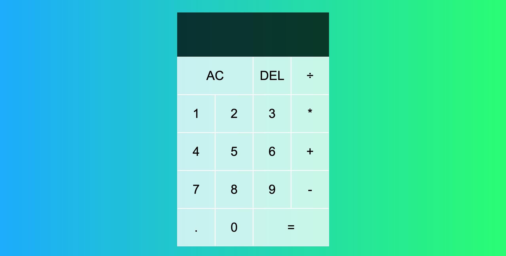

# A React Calculator

This project was bootstrapped with [Create React App](https://github.com/facebook/create-react-app).




## Table of contents

- [Overview](#overview)
  - [The challenge](#the-challenge)
  - [Links](#links)
- [My process](#my-process)
  - [Built with](#built-with)
  - [What I learned](#what-i-learned)
- [Author](#author)
- [Acknowledgments](#acknowledgments)

## Overview

### The challenge

Users should be able to:

- Use a functioning calculator that calculates all their arithmetic operations


### Links

- Live Site URL: [React Calculator](hhttps://seun-works.github.io/React-Calculator/)

## My process

My thinking process in building this react calculator couldve been made easier if i had relied on a third party library to aid in my calculators computation ability. However, i felt that it was necessary to learn how to create the computational operations from scratch by using the react hook useReducer.

### Built with

- React Components.
- React hooks.
- [React](https://reactjs.org/) - JS library

### What I learned

Building the look of the calculator was relatively easy as that just needed a level of competence from my continuous practice with react. However, the real hurdle came from 
creating the calculator operations from scratch. Like a normal calculator, there are four actions that a calculator should be able to acheive in its computation. These are, adding digits, choosing an operation to be done on these digits, clearing the computated values, deleting each digit from the screen, and evaluating the digits.
I achieved this by making use of the react hook Use reducer, i could have chosen to just use state but using a reducer allows me to be more productive with my time, and it allows
me to manage states that are dependent on other states.
Kindly find a snippet of the reducer down below.

```js
//This is a reducer which gives each button in the calculator its functionality
const reducer = (state, {type, payload}) => {
  switch(type) {
    //This gives the calculator the digit adding functionality
    case ACTIONS.ADD_DIGIT:
      if(state.overwrite) {
        return {
          ...state,
          currentOperand: payload.digit,
          overwrite: false
        }
      }
      
      if(payload.digit === '0' && state.currentOperand === '0') {
        return state}
      if(payload.digit === '.' && state.currentOperand.includes(".")) {
        return state }
      return {
        ...state,
        currentOperand: `${state.currentOperand || ""}${payload.digit}`,
      }
      
    //This allows the calculator to clear all the output   
    case ACTIONS.CLEAR: 
     return {
       
     }  
    

    //This allows the calculator to remove either one digit or a whole compouted value 
    case ACTIONS.DELETE_DIGIT:
      if(state.overwrite) {
        return {
          ...state,
          overwrite: false,
          currentOperand: null
        }
      }
      if(state.currentOperand == null) {
        return state
      }
      if(state.currentOperand.length === 1 ) {
        return {
          ...state,
          currentOperand: null
        }
      }
      return {
        ...state,
        currentOperand: state.currentOperand.slice(0, -1)

      }

    //This allows the calculator to choose any operation of our choice  
     case ACTIONS.CHOOSE_OPERATION:
       if(state.currentOperand == null && state.previousOperand == null) {
         return state
       }

       if(state.currentOperand == null) {
         return {
           ...state,
           operation: payload.operation
         }
       }

       if(state.previousOperand == null) {
         return{
          ...state,
          operation: payload.operation,
          previousOperand: state.currentOperand,
          currentOperand: null
         }
       }
       return {
         ...state,
         previousOperand: evaluate(state),
         currentOperand: null,
         operation: payload.operation
       }


      //This gives the calculator its true functioanlity, which is to calculate whatever we want to do 
      case ACTIONS.EVALUATE: 
       if(state.operation == null || state.currentOperand == null || state.previousOperand == null) {
         return state
       }
       return {
         ...state,
         overwrite: true,
         previousOperand: null,
         currentOperand: evaluate(state),
         operation: null
       }
  }
}
```

## Author

- Website - [Seun Ogundipe](https://frosty-dubinsky-40fb7f.netlify.app)


## Acknowledgments

I want to give thanks to Web dev simplified, for being the inspiration to this project, as I did not have to reinvent the wheel in the execution of this project.
